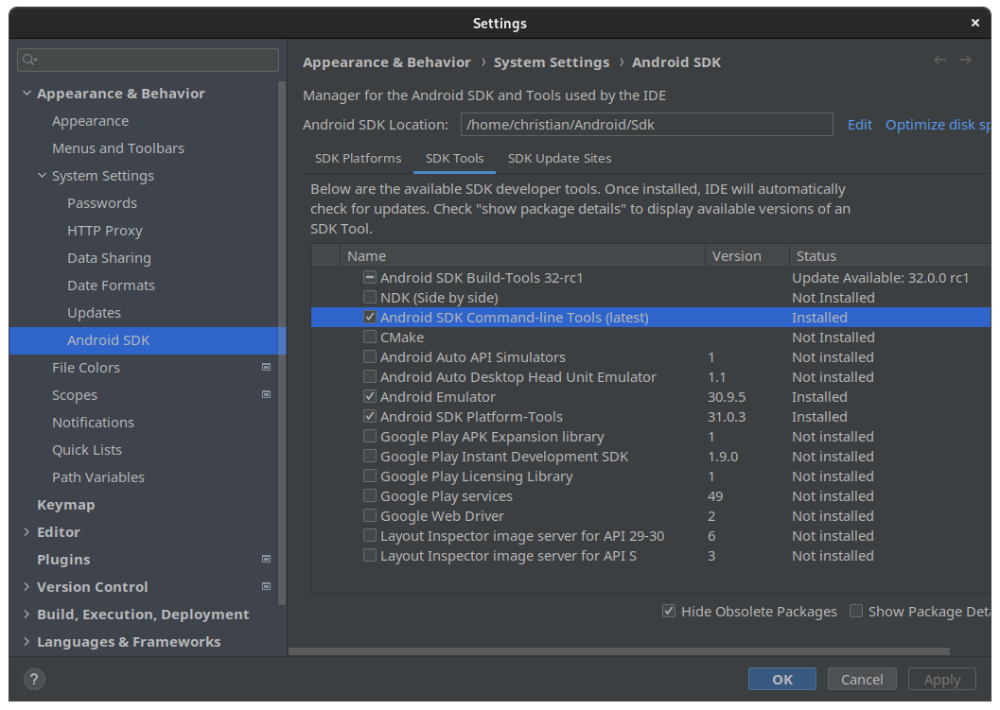
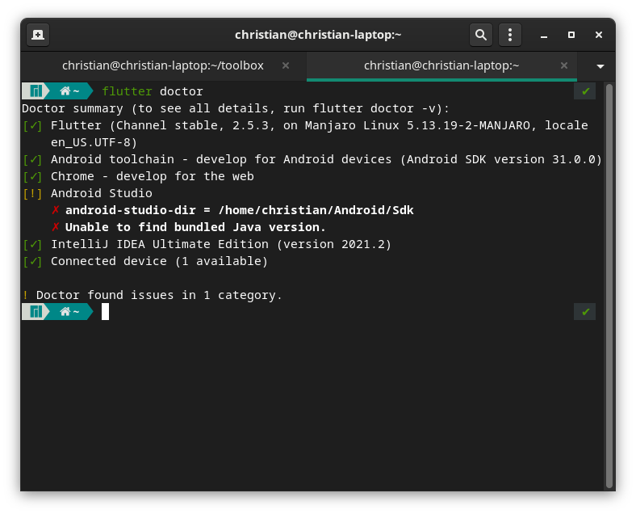

# Flutter installieren auf Manjaro

Christian Grubmüller, 14.11.2021

#### Flutter an sich installieren

Mit folgendem Befehl kann man flutter an sich und die Dart SDK installieren.

```bash
sudo snap install flutter --classic
```

##### Dart SDK Pfad

Die Dart SDK ist direkt bei flutter installiert. Pfad: `/home/christian/snap/flutter/common/flutter/bin/cache/dart-sdk`

#### Intellij Ultimate installieren

Um IntelliJ zu installieren kann man *snap* verwenden.

```bash
sudo snap install intellij-idea-ultimate --classic
```

#### AndroidSDK installieren 

Die AndroidSDK installiert man am am Besten über IntelliJ. Dazu muss man in `File>Settings>Appearance & Behavior>Andorid SDK` die AndroidSDK herrunterladen. Diese wird in Manjaro unter `/home/christian/Android/Sdk` abgespeichert.

Diesen Pfad muss man dann auch noch für Flutter setzten. Das kann man mit folgendem Befehl machen.

```bash
flutter config --android-sdk /home/christian/Andorid/Sdk
```

Eventuell kommt dann in flutter ein Fehler, dass man die *Andorid SDK Command-line Tools(latest)* installieren muss. Das kann man im selben Fenster machen, in dem man die Android SDK herruntergeladen hat. (Bei den Reitern *SDK Tools* auswählen und dann den markierten Eintrag auswählen und herrunterladen.)




#### Chrome installieren

Chrome kann man über das AUR (Arch User Repository) herrunterladen und installieren. Das kann man mit dem Packetmanagement *yay* erledigen. Wie man yay installiert findet man [hier](./yay.md).

```bash
yay -S google-chrome
```

##### Pfad setzten

Damit Flutter Chrome erkennt, muss man die Umgebungsvairable *CHROME_EXECUTABLE* setzten.

```bash
export CHROME_EXECUTABLE=/opt/google/chrome/chrome
```

Dieser Befehl setzt die Umgebunsvariable allerdings nur für diese eine Session im Terminal. Deshalb muss man den obrigen Befehl noch in das File `~/.profile` schreiben. Jedesmal wenn man sich einloggt wird dieses File geladen und die Umgebungsvariablen sind richtig gesetzt.


#### Flutter doctor

Jetzt kann man  `flutter doctor` im Terminal ausführen können und alles sollte funktionieren.


