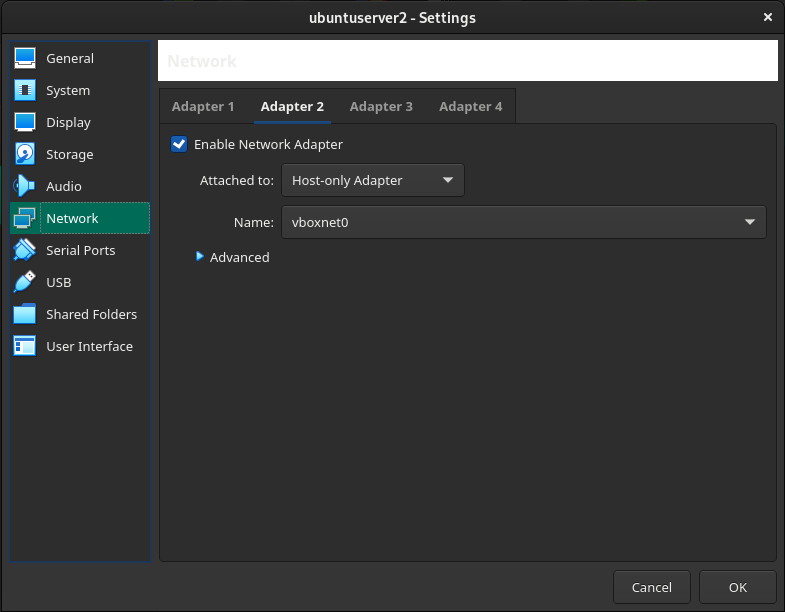

# Virtual Box

Christian Grubmüller, 3.12.2021

Weil die Lizenz von VM Ware ausgelaufen ist, verwende ich jetzt Virtual Box.

## Installation

Virtual Box kann man einfach über den Packetmanager herunterladen und installieren.

## Fehler

Bei mir ist dann ein Fehler gekommen, dass nicht die richtigen Teiber für den Kernel vorhanden waren und dass ich das File `sbin/vboxconfig` ausführen soll. Diese File hat aber nicht existiert. Mithilfe von diesem [Link](https://archived.forum.manjaro.org/t/virtualbox-wont-work-no-sbin-vboxconfig-file/96517/3) hab ich das Problem löschen können.

Zuerst habe ich mit dem Befehl `mhwd-kernel -li` nachgeschaut, welche Kernels auf meinem Rechner installiert sind. Dann bin ich in den Packetmanager gegangen und habe die entsprechenden Packete für Virtual Box herruntergeladen. (*linux<version>-virtualbox-host-modules*)

 ```bash 
 > mhwd-kernel -li
 Currently running: 5.13.19-2-MANJARO (linux513)
 The following kernels are installed in your system:
 
    * linux414
    * linux513
    * linux54
 ```


Anschließend haben meine VMs funktioniert.


## SSH

Eine SSH-Verbindung mit den VMs in Virtual Box herzustellen ist etwas komplizierter, als in VM Ware. 

1. Zuerst muss man eine VM erstellen. 

2. Dann drückt man unter *Setting* auf *Network* und klappt dann die *advanced*-Options aus.


3. Drückt man auf *Port Forwarding* und fügt eine Regel hinzu. Als Host-IP verwendet mann dann die IP-Adresse `127.0.1.1` (für die 2. VM `127.0.1.2`, für die 3. `127.0.1.3` usw.) und als *Host Port*  `2222`. Als *Guest IP* verwendet man immer `10.0.2.15` und als *Guest Port* `22`.


4. Jetzt kann man sich über das Terminal am Host mittels SSH auf die VM verbinden.

   ```bash
   ssh <username>@127.0.1.1 -p 2222
   ```


## VM untereindander verbinden

Standardmäßig, können sich die VMs nicht mittels der IP-Adresse verbinden. Um das zu lösen, muss man Virtual Network erstellen. Jeder VM, die sich damit verbinden muss, muss man ein neuen Netzwerkadapter hinzufügen und sie als *Host-only* mit dem richtigen Netzwerk konfigurieren.



### *IP fixen*

Weil Virtualbox bei mir die selbe IP vergibt für mehrere VMs musste ich zuerst in Virtualbox ein Host Network erstellen und dann bei den einzelnen VMs habe ich dann einen zweiten Netzwerk Adapter hinzugefügt mit dem Typen Host-Only. 

#### Temoräre Lösung

*In den Vms habe ich das Interface hochgefahren und die IP mit dhcp gesetzt. Damit hat es funktioniert. Diese Lösung ist allerdings nur temporär.*

```bash
sudo ip link set enp0s8 up
sudo dhclient enp0s8
```

#### Permanente Lösung

 *Wenn man permanent eine IP-Adresse für die VM haben will, kann man die Konfugration im File `/etc/netplan/00-installer-config.yaml` machen.*

```bash
# This is the network config written by 'subiquity'
network:
  ethernets:
    enp0s3:
      dhcp4: true
    enp0s8:
      dhcp4: true
      dhcp-identifier: mac # Für geklonte VMs.
  version: 2
```

*Dann muss man den `netplan` "neustarten".* 

```bash
sudo netplan apply
```

Anschließend hat man eine IP.
